### 微服务

#### 概述

微服务（Microservices）是一种软件架构风格(**分布式架构)**，它将一个大型的应用程序拆分为多个小型、独立的服务。每个服务都运行在自己的进程中，并通过轻量级的通信机制（如HTTP、gRPC）与其他服务进行交互。每个微服务通常围绕特定的业务功能构建，并且可以独立开发、部署和扩展。

#### 特点

- 单一职责：微服务拆分粒度更小，每一个服务都对应唯一的业务能力，做到单一职责

- 自治：团队独立、技术独立、数据独立，独立部署和交付

- 面向服务：服务提供统一标准的接口，与语言和技术无关

- 隔离性强：服务调用做好隔离、容错、降级，避免出现级联问题

  

#### 单体架构与分布式架构的区别

单体架构:

```
架构比较简单，部署成本低，但是代码耦合度高，维护困难，程序升级麻烦。
```

分布式架构:

```
根据业务功能对系统做拆分，每个业务功能模块作为独立项目开发，称为一个服务。可以降低服务之间的耦合，便于程序升级和拓展，但是部署麻烦，调用关系错综复杂。
```

注意: **微服务架构**是一种经过良好架构设计的**分布式架构方案**


#### 架构方案落地

在Java领域最多人使用的就是SpringCloud提供的方案。（SpringCloud是微服务架构的一站式解决方案，集成了各种优秀的微服务功能组件）


#### SpringCloud

官网: https://spring.io/projects/spring-cloud

SpringCloud集成了各种微服务功能组件，并基于SpringBoot实现了这些组件的自动装配，从而提供了良好的开箱即用体验。

##### 常用组件

| 功能                 | 技术                     |
| -------------------- | ------------------------ |
| 服务注册发现         | Eureka、Nacos、Consul    |
| 服务远程调用         | OpenFeign、Dubbo         |
| 服务链路监控         | Zipkin、Sleuth           |
| 统一配置管理         | SpringCloudConfig、Nacos |
| 统一网关路由         | SpringClouGateway、Zuul  |
| 流量控制、降级、保护 | Hystix、Sentinel         |


注意: Spring Boot 和 Spring Cloud 的版本对应关系非常重要，因为不同版本的 Spring Cloud 需要特定版本的 Spring Boot 来支持。官网可进行查看版本对应关系。

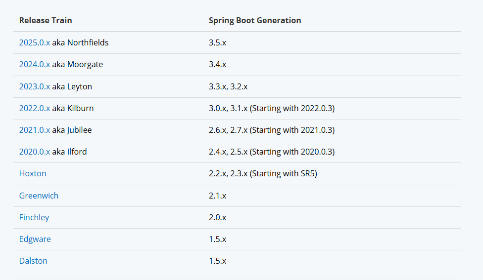


#### 服务拆分与远程调用

##### 拆分原则

1、不同微服务，不要重复开发相同业务。

2、微服务数据独立，不要访问其它微服务的数据库。

3、微服务可以将自己的业务暴露为接口，供其它微服务调用。

##### 例子

商品订单的管理： 拆分订单微服务和用户微服务

(1)订单微服务，负责订单相关业务，有独立的数据库，单独的项目，对外暴露Restful的接口

(2)用户微服务，负责用户相关业务，有独立的数据库，单独的项目，对外暴露Restful的接口


用户相关接口:

```java
@Slf4j
@RestController
@RequestMapping("/user")
public class UserController {

    @Autowired
    private UserService userService;
    
    @GetMapping("/{id}")
    public User queryById(@PathVariable("id") Long id) {
        return userService.queryById(id);
    }
}
```

用户接口的实现

```java
@Service
public class UserService {

    @Autowired
    private UserMapper userMapper;

    public User queryById(Long id) {
        return userMapper.findById(id);
    }
}
```

订单相关接口

```java
@RestController
@RequestMapping("order")
public class OrderController {

   @Autowired
   private OrderService orderService;

    @GetMapping("{orderId}")
    public Order queryOrderByUserId(@PathVariable("orderId") Long orderId) {
        return orderService.queryOrderById(orderId);
    }
}
```

订单接口实现

```java
@Service
public class OrderService {

    @Autowired
    private OrderMapper orderMapper;

    public Order queryOrderById(Long orderId) {
        Order order = orderMapper.findById(orderId);
        return order;
    }
}
```

##### 远程调用

订单接口通过订单表的用户id去远程调用用户信息服务，对外暴露的接口，获取对应用户的信息。

（1）使用RestTemplate去实现服务的远程调用

在订单启动类中注入RestTemplate

```java
@MapperScan("com.ransibi.order.mapper")
@SpringBootApplication
public class OrderApplication {

    public static void main(String[] args) {
        SpringApplication.run(OrderApplication.class, args);
    }

    @Bean
    public RestTemplate restTemplate() {
        return new RestTemplate();
    }

}
```

实现类中进行远程调用

```java
@Service
public class OrderService {

    @Autowired
    private OrderMapper orderMapper;

    @Autowired
    private RestTemplate restTemplate;

    public Order queryOrderById(Long orderId) {
        Order order = orderMapper.findById(orderId);

        Long userId = order.getUserId();
        String port = "8081";
        String url = "http://127.0.0.1:" + port + "/user/" + userId;

        //开始远程调用
        User resultUser = restTemplate.getForObject(url, User.class);
        order.setUser(resultUser);

        return order;
    }
}
```

#### Eureka注册中心

##### 核心功能

1. 服务注册：服务(EurekaClient)启动时，会向 Eureka 服务器(EurekaServer)注册自己的信息，如 IP 地址和端口。
2. 服务发现：服务消费者(EurekaClient)通过 Eureka(EurekaServer) 查找所需服务的实例信息。
3. 健康检查：Eureka (EurekaServer)定期检查服务实例(EurekaClient)的健康状态，移除不健康的实例。
4. 负载均衡：结合 Ribbon 等工具，Eureka 支持客户端负载均衡。

```
Eureka Server：提供服务注册与发现功能。

Eureka Client：嵌入在服务中，负责与 Eureka Server 通信。
```

##### Eureka服务端实现

pom.xml

```xml
<?xml version="1.0" encoding="UTF-8"?>
<project xmlns="http://maven.apache.org/POM/4.0.0"
         xmlns:xsi="http://www.w3.org/2001/XMLSchema-instance"
         xsi:schemaLocation="http://maven.apache.org/POM/4.0.0 http://maven.apache.org/xsd/maven-4.0.0.xsd">
    <modelVersion>4.0.0</modelVersion>

    <parent>
        <groupId>org.springframework.boot</groupId>
        <artifactId>spring-boot-starter-parent</artifactId>
        <version>2.3.9.RELEASE</version>
    </parent>

    <groupId>com.ransibi</groupId>
    <artifactId>eureka_server</artifactId>
    <version>1.0-SNAPSHOT</version>

    <properties>
        <maven.compiler.source>8</maven.compiler.source>
        <maven.compiler.target>8</maven.compiler.target>
        <project.build.sourceEncoding>UTF-8</project.build.sourceEncoding>
        <project.reporting.outputEncoding>UTF-8</project.reporting.outputEncoding>
        <java.version>1.8</java.version>
    </properties>


    <dependencyManagement>
        <dependencies>
            <dependency>
                <groupId>org.springframework.cloud</groupId>
                <artifactId>spring-cloud-dependencies</artifactId>
                <version>Hoxton.SR12</version>
                <type>pom</type>
                <scope>import</scope>
            </dependency>
        </dependencies>
    </dependencyManagement>

    <dependencies>
        <dependency>
            <groupId>org.springframework.cloud</groupId>
            <artifactId>spring-cloud-starter-netflix-eureka-server</artifactId>
        </dependency>
    </dependencies>

</project>
```

启动类

```java
@SpringBootApplication
@EnableEurekaServer
public class Main {
    public static void main(String[] args) {
        SpringApplication.run(Main.class);
    }
}
```

配置信息

```yaml
server:
  port: 10086

spring:
  application:
    # erueka的服务名称
    name: erueka-server
eureka:
  client:
    service-url:
      # erueka的地址信息，如果是集群则是多个
      defaultZone: http://127.0.0.1:10086/eureka
```

启动后访问

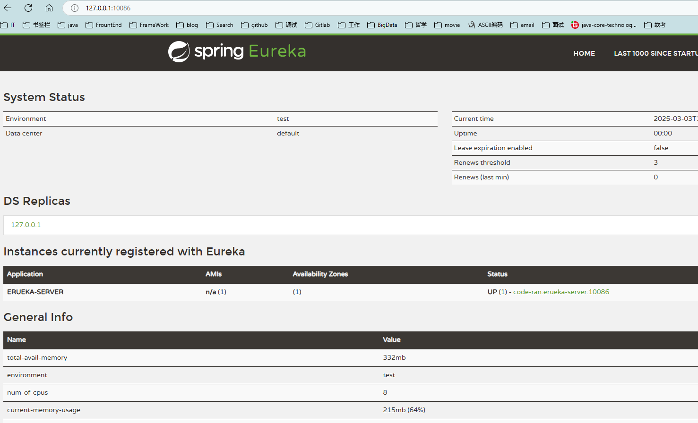

##### 使用erueka客户端实现服务注册

pom引入

```
        <dependency>
            <groupId>org.springframework.cloud</groupId>
            <artifactId>spring-cloud-starter-netflix-eureka-client</artifactId>
        </dependency>
```

修改配置

```yaml
server:
  port: 8081
spring:
  application:
    name: user-service
  datasource:
    url: jdbc:mysql://localhost:3306/cloud_user?useSSL=false
    username: root
#    password: mysql0925
    password: 123456rsb
    driver-class-name: com.mysql.jdbc.Driver

eureka:
  client:
    service-url:
      defaultZone: http://127.0.0.1:10086/eureka


mybatis:
  type-aliases-package: com.ransibi.user.pojo
  configuration:
    map-underscore-to-camel-case: true

logging:
  level:
    cn.itcast: debug
  pattern:
    dateformat: MM-dd HH:mm:ss:SSS
```


##### 使用erueka客户端实现服务发现

pom引入

```
        <dependency>
            <groupId>org.springframework.cloud</groupId>
            <artifactId>spring-cloud-starter-netflix-eureka-client</artifactId>
        </dependency>
```

```yaml
server:
  port: 8080
spring:
  application:
    name: order-service
  datasource:
    url: jdbc:mysql://localhost:3306/cloud_order?useSSL=false
    username: root
#    password: mysql0925
    password: 123456rsb
    driver-class-name: com.mysql.jdbc.Driver

eureka:
  client:
    service-url:
      defaultZone: http://127.0.0.1:10086/eureka
      

mybatis:
  type-aliases-package: com.ransibi.user.pojo
  configuration:
    map-underscore-to-camel-case: true
logging:
  level:
    cn.itcast: debug
  pattern:
    dateformat: MM-dd HH:mm:ss:SSS
```

启动order-service和user-service服务


启动两个user-service模拟集群注册

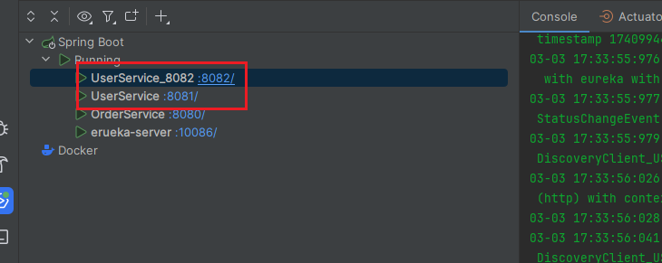

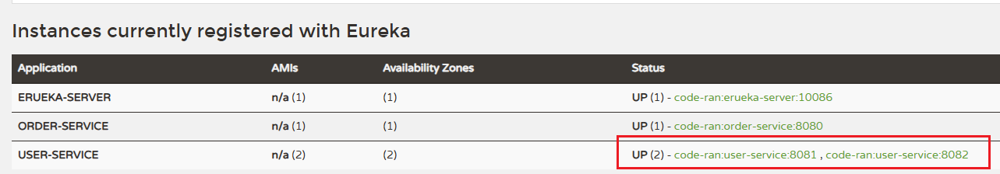

修改order-service远程调用的代码，通过服务发现去拉取注册中心的user-service服务

```java
@Service
public class OrderService {

    @Autowired
    private OrderMapper orderMapper;

    @Autowired
    private RestTemplate restTemplate;

    public Order queryOrderById(Long orderId) {
        Order order = orderMapper.findById(orderId);

        Long userId = order.getUserId();
        String port = "8081";
//        String url = "http://127.0.0.1:" + port + "/user/" + userId;
        //从注册中心里拿
        String url ="http://user-service/user/"+userId;
        //开始远程调用
        User resultUser = restTemplate.getForObject(url, User.class);
        order.setUser(resultUser);

        return order;
    }
}
```

启动类加载RestTemplate的地方使用负载均衡的注解

```java
    @Bean
    @LoadBalanced
    public RestTemplate restTemplate() {
        return new RestTemplate();
    }
```

这样就实现了服务的发现功能。

#### Ribbon负载均衡

SpringCloud底层使用了一个名为Ribbon的组件，来实现负载均衡功能的。

| **内置负载均衡规则类**    | **规则描述**                                                 |
| ------------------------- | ------------------------------------------------------------ |
| RoundRobinRule            | 简单轮询服务列表来选择服务器。它是Ribbon默认的负载均衡规则。 |
| AvailabilityFilteringRule | 对以下两种服务器进行忽略：   （1）在默认情况下，这台服务器如果3次连接失败，这台服务器就会被设置为“短路”状态。短路状态将持续30秒，如果再次连接失败，短路的持续时间就会几何级地增加。  （2）并发数过高的服务器。如果一个服务器的并发连接数过高，配置了AvailabilityFilteringRule规则的客户端也会将其忽略。并发连接数的上限，可以由客户端的<clientName>.<clientConfigNameSpace>.ActiveConnectionsLimit属性进行配置。 |
| WeightedResponseTimeRule  | 为每一个服务器赋予一个权重值。服务器响应时间越长，这个服务器的权重就越小。这个规则会随机选择服务器，这个权重值会影响服务器的选择。 |
| **ZoneAvoidanceRule**     | 以区域可用的服务器为基础进行服务器的选择。使用Zone对服务器进行分类，这个Zone可以理解为一个机房、一个机架等。而后再对Zone内的多个服务做轮询。 |
| BestAvailableRule         | 忽略那些短路的服务器，并选择并发数较低的服务器。             |
| RandomRule                | 随机选择一个可用的服务器。                                   |
| RetryRule                 | 重试机制的选择逻辑                                           |

默认的实现就是ZoneAvoidanceRule，是一种轮询方案。

Ribbon默认是采用懒加载，即第一次访问时才会去创建LoadBalanceClient，请求时间会很长。

而饥饿加载则会在项目启动时创建，降低第一次访问的耗时，通过下面配置开启饥饿加载：

```yaml
ribbon:
  eager-load:
    enabled: true
    clients: userservice
```


#### Nacos注册中心

[Nacos](https://nacos.io/)是阿里巴巴的产品，现在已经被集成到[SpringCloud](https://spring.io/projects/spring-cloud)中，成为了springcloud的一个组件。相比[Eureka](https://github.com/Netflix/eureka)功能更加丰富，在国内受欢迎程度较高。Nacos是SpringCloudAlibaba的组件，而SpringCloudAlibaba也遵循SpringCloud中定义的服务注册、服务发现规范。因此使用Nacos和使用Eureka对于微服务来说，并没有太大区别。


##### nacos服务注册与发现

pom.xml

```xml
<!--            nacos管理依赖-->
            <dependency>
                <groupId>com.alibaba.cloud</groupId>
                <artifactId>spring-cloud-alibaba-dependencies</artifactId>
                <version>2.2.6.RELEASE</version>
                <type>pom</type>
                <scope>import</scope>
            </dependency>
            
        <!--        nacos客户端依赖-->
        <dependency>
            <groupId>com.alibaba.cloud</groupId>
            <artifactId>spring-cloud-starter-alibaba-nacos-discovery</artifactId>
        </dependency>
```

nacos连接配置

```yaml
spring:
  #nacos连接配置
  application:
    name: user-service
  cloud:
    nacos:
      server-addr: localhost:8848
```

启动服务,order-service和user-service都注册到了配置中心

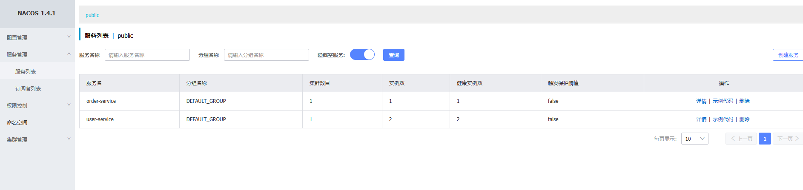

请求order-service接口

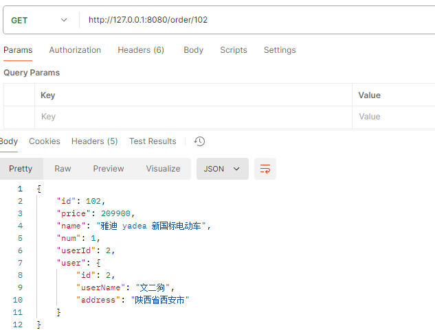

order-service实现中，从nacos的配置中心获取到了user-service的信息。实现与服务的发现功能。

```java
    public Order queryOrderById(Long orderId) {
        Order order = orderMapper.findById(orderId);

        Long userId = order.getUserId();
        String port = "8081";
//        String url = "http://127.0.0.1:" + port + "/user/" + userId;
        //从注册中心里拿
        String url ="http://user-service/user/"+userId;
        //开始远程调用
        User resultUser = restTemplate.getForObject(url, User.class);
        order.setUser(resultUser);

        return order;
    }
```


##### nacos服务分级存储模型

| 级别 | 名称                     |
| ---- | ------------------------ |
| 一级 | 服务(user-service)       |
| 二级 | 集群(HZ、SH......)       |
| 三级 | 实例(部署了服务的服务器) |

nacos将同一机房内的实例划分为一个集群。

1.配置集群

```yaml
spring:
  cloud:
    nacos:
      server-addr: localhost:8848
      discovery:
        cluster-name: HZ # 集群名称
```

启动user-service两次(8081、8082)

可以看到HZ的两个集群实例已经存在。

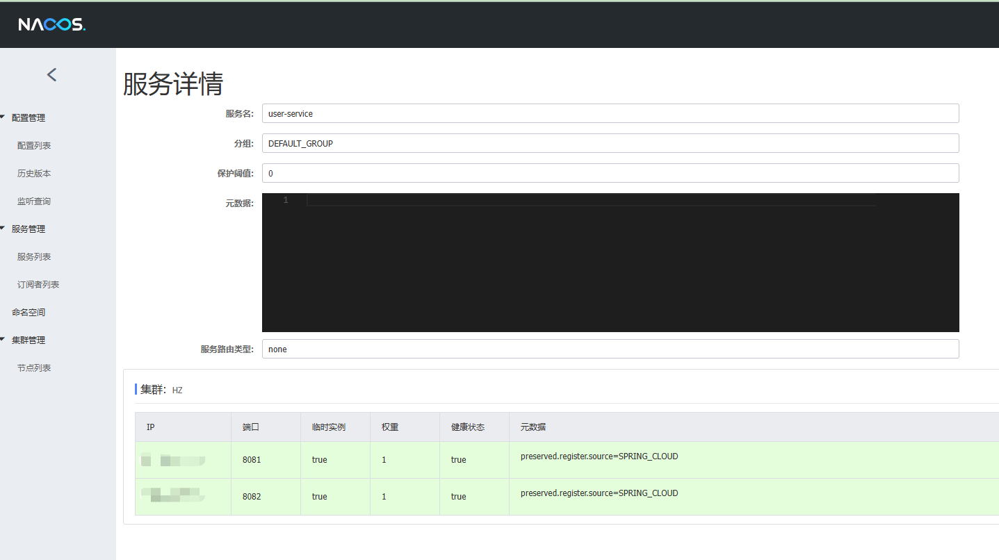

修改user-service的集群配置

```yaml
spring:
  cloud:
    nacos:
      server-addr: localhost:8848
      discovery:
        cluster-name: SH # 集群名称
```

拷贝启动项配置

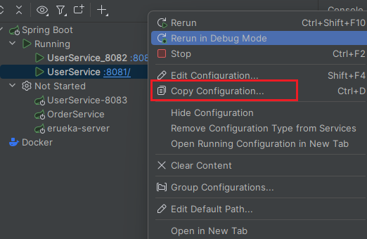

修改启动项名称-->modify options--->add vm options,并添加相关启动配置


```
-Dserver.port=8083 
-Dspring.cloud.nacos.discovery.cluster-name=SH
```

启动8083

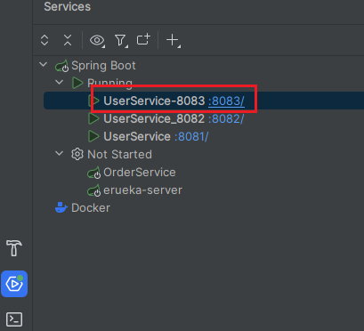

nacos中出现了两个集群HZ和SH

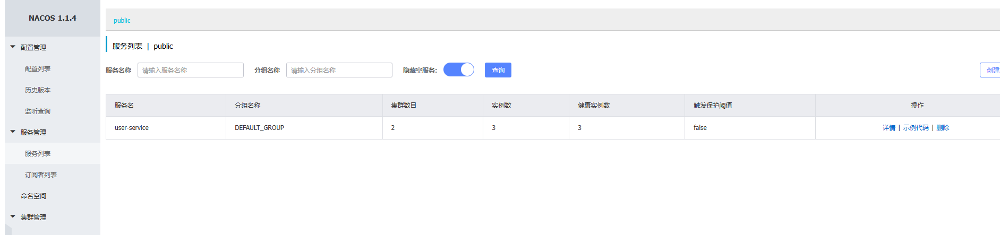

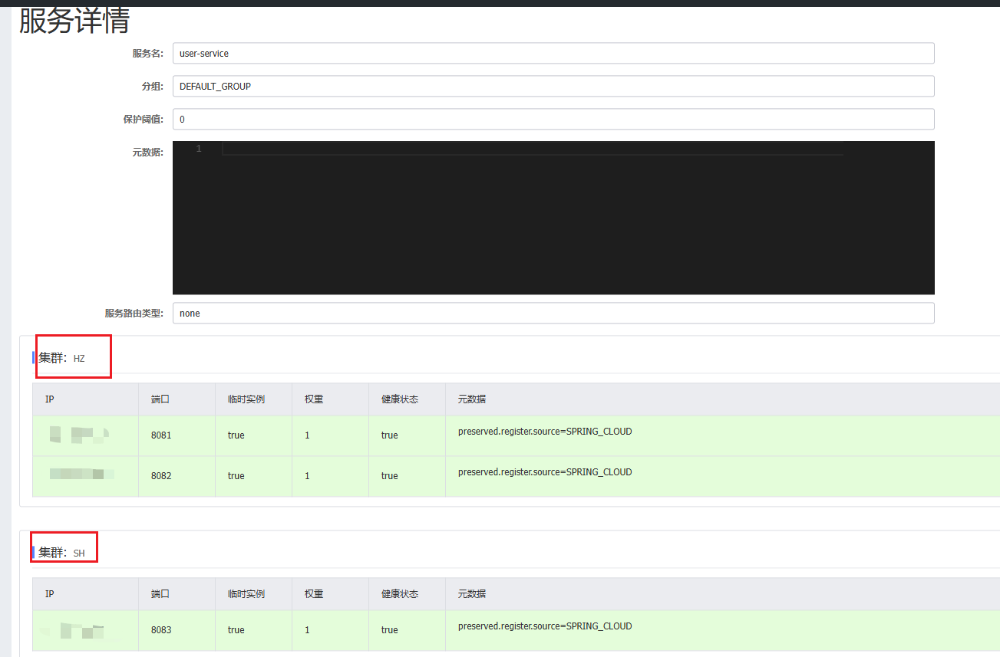

##### nacos相同集群优先的负载均衡

nacos默认是走轮询的负载均衡，如果想实现同集群优先的情况，必须进行负载均衡的配置。

修改order-service的ribbon负载均衡规则，然后启动

```yaml
  #nacos连接配置
  cloud:
    nacos:
      server-addr: localhost:8848
      #配置集群
      discovery:
        cluster-name: HZ # 集群名称
```


```yaml
#ribbon负责均衡规则配置
userservice:
  ribbon:
    NFLoadBalancerRuleClassName: com.alibaba.cloud.nacos.ribbon.NacosRule # 负载均衡规则,同集群优先规则
```

##### nacos权重配置

服务器设备性能有差异，部分实例所在机器性能较好，另一些较差，希望性能好的机器承担更多的用户请求。默认情况下NacosRule是同集群内随机挑选，不会考虑机器的性能问题。因此，Nacos提供了权重配置来控制访问频率，权重越大则访问频率越高。

在nacos控制台，找到user-service的实例列表，点击编辑，即可修改权重，如果权重修改为0，则该实例永远不会被访问。(可以实现程序平滑升级)

在弹出的编辑窗口，修改权重：

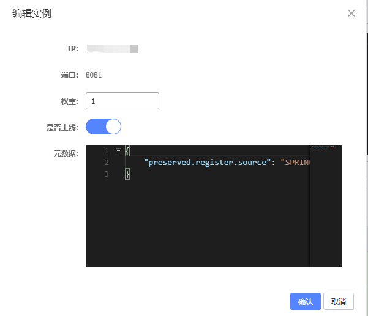

##### nacos环境隔离

每个命名空间相关隔离

新增一个dev命名空间，并修改order-service的nacos连接配置

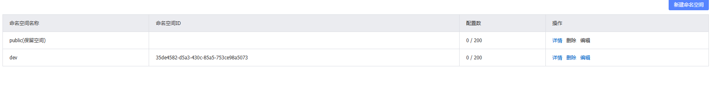

```yaml
spring:
  application:
    name: order-service
    
  #nacos连接配置
  cloud:
    nacos:
      server-addr: localhost:8848
      #配置集群
      discovery:
        cluster-name: HZ # 集群名称
        #nacos命名空间
        namespace: 35de4582-d5a3-430c-85a5-753ce98a5073
```

请求user-service服务会报错，因为user-service服务不在dev命名空间中。

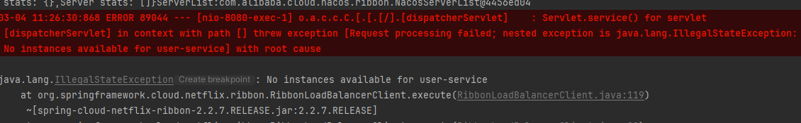


#### Erueka和Nacos的区别

| **特性**       | **Nacos**                                                | **Eureka**                                                  |
| :------------- | :------------------------------------------------------- | :---------------------------------------------------------- |
| **服务发现**   | 支持服务注册与发现，提供健康检查机制。                   | 支持服务注册与发现，提供健康检查机制。                      |
| **配置管理**   | 提供动态配置管理功能，支持配置的发布、更新和监听。       | 不提供配置管理功能，需结合 Spring Cloud Config 等工具使用。 |
| **健康检查**   | 支持多种健康检查方式（如 TCP、HTTP、MySQL 等）。         | 主要依赖客户端心跳机制进行健康检查。                        |
| **多语言支持** | 支持多种语言（如 Java、Go、Python 等），适合异构系统。   | 主要针对 Java 生态，依赖 Spring Cloud 生态。                |
| **一致性协议** | 支持 AP（高可用）和 CP（强一致性）模式，可根据场景切换。 | 仅支持 AP 模式，强调高可用性。                              |
| **服务元数据** | 支持丰富的服务元数据配置。                               | 支持基本的服务元数据配置。                                  |
| **集群模式**   | 支持集群部署，具备较强的扩展性。                         | 支持集群部署，但扩展性较弱。                                |
| **社区生态**   | 由阿里巴巴开源，社区活跃，文档丰富。                     | 由 Netflix 开源，目前已停止维护，社区活跃度较低。           |


nacos配置实例为永久实例

```yaml
spring:
  cloud:
    nacos:
      discovery:
        ephemeral: false # 设置为非临时实例
```

#### nacos配置管理

##### 统一配置管理

Nacos可以将配置集中管理，还可以在配置变更时，及时通知微服务，实现配置的热更新。

1.在nacos中添加配置文件

在配置列表中进行配置的新增(需要进行热更新的配置，交给nacos进行管理，不会变的配置使用本地的配置)

```
data id: user-service-dev.yaml
```

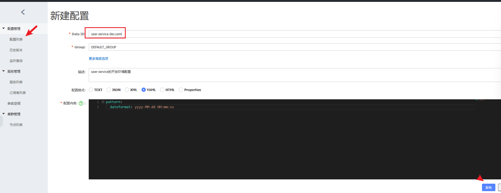

2.从微服务拉取配置

nacos配置管理依赖

```xml
<dependency>
    <groupId>com.alibaba.cloud</groupId>
    <artifactId>spring-cloud-starter-alibaba-nacos-config</artifactId>
</dependency>
```

spring引入了一种新的配置文件：bootstrap.yaml文件，会在application.yml之前被读取。增加bootstrap.yaml配置文件

```yaml
spring:
  application:
    name: user-service # 服务名称
  profiles:
    active: dev #开发环境，这里是dev 
  cloud:
    nacos:
      server-addr: localhost:8848 # Nacos地址
      config:
        file-extension: yaml # 文件后缀名
```

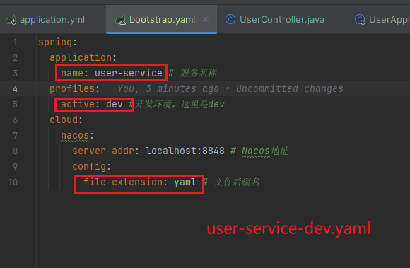

3.读取nacos配置

```java
    @Value("${pattern.dateformat}")
    private String dateFormat;
    
    @GetMapping("/nowTime")
    public String getNowTime() {
        SimpleDateFormat dateFormat1 = new SimpleDateFormat(dateFormat);
        return dateFormat1.format(new Date());
    }
```

请求

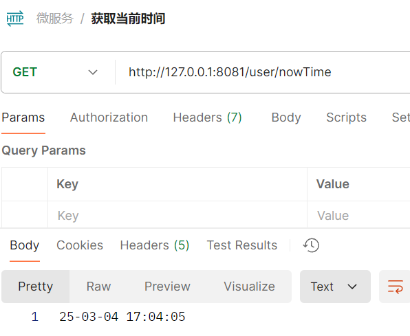

##### 配置热更新


##### 配置共享


##### 搭建nacos集群
